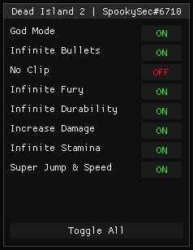
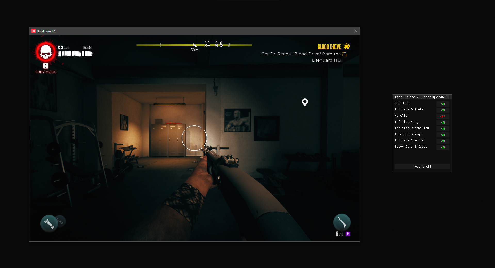

# A DeadIsland2 External Cheat

## Features
- God Mode
- Infinite Ammo
- Infinite Durability on Weapons
- Infinite Fury
- Infinite Stamina
- Increased Damage
- Increased Jump Height and Walk Speed
- No Clip

## TODO
- [ ] Add ESP (Loot ESP maybe?)

## Compiling
Honestly if you don't know how to compile a C++ project, then maybe you shouldn't be here.

Open the .sln file in Visual Studio, Ctrl + Shift + B to compile solution, find the produced EXE under `DeadIsland2External/build/DeadIsland2External.exe`

Game has no anti-cheat, running shoudl be just fine

## Precompiled EXE
A compiled EXE can be found under `build/` in this repo.

## Screenshots
### MENU

### DESKTOP

## Credits
- Cragson for his awesome "osmium" external framework: https://github.com/cragson/osmium
- Frisla for his external C# .NET cheat for this game (definitely did steal offsets): https://www.unknowncheats.me/forum/other-fps-games/583251-dead-island-2-frisla-menu.html
- xo1337 for his external DX9 ImGui Base: https://github.com/xo1337/imgui-external-base (didn't even bother edit the colors, they look really nice)
